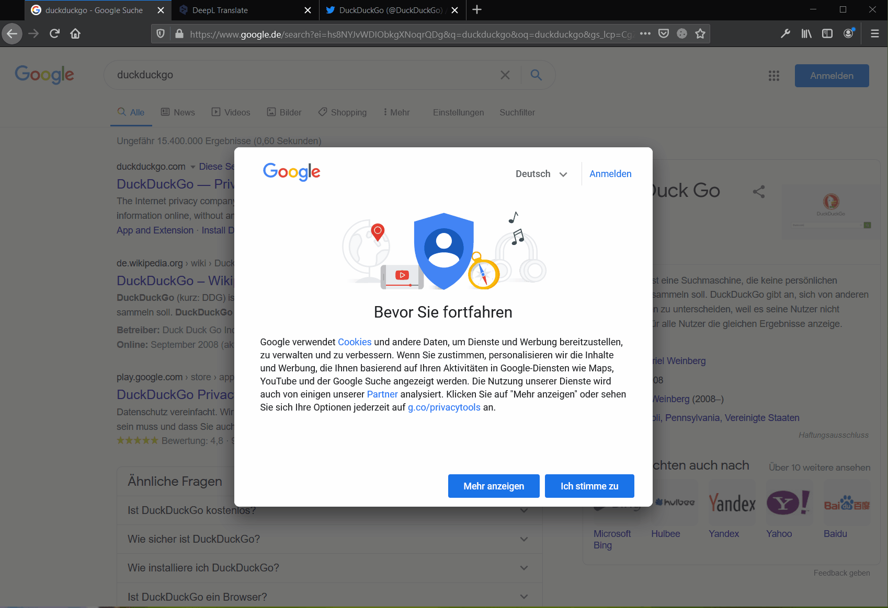

# [Cookie Banner Blocker](https://addons.mozilla.org/de/firefox/addon/cookie-banner-blocker/)

Ein Cookie-Banner-Blocker, der die meisten Cookie- und Newsletter-Popups ohne Blockliste entfernt.   
Es werden auch sogenannte "Einwilligungs-Cookie-Banner-Seiten" erkannt, welche den Benutzer vor dem Öffnen der Seite für eine Zustimmung weiterleiten.  

[Firefox Addons](https://addons.mozilla.org/de/firefox/addon/cookie-banner-blocker/)

## Ziel des Projektes
Es gibt bereits die Möglichkeit, Cookie-Banner über Blocklisten zu blockieren (unter anderem auch mit dem [uBlock Origin](https://github.com/gorhill/uBlock/)). Dieses Projekt zielt jedoch darauf ab, "neue" Banner oder Redirect-Banner **ohne** Blockliste zu erkennen und auszublenden (ohne eine Zustimmung zugeben).

Leider ist die Erkennung nicht perfekt, daher gibt es die Möglichkeit, den Cookie-Banner-Blocker **mit nur einem Klick für eine einzelne Seite zu deaktivieren**:  

## Wie funktioniert die Erkennung?
Ich konnte grob drei verschiedene Kategorien von Bannern identifizieren.

### einfache Cookie-Banner
Diese befinden sich meist am unteren Rand der Seite und sind durch ihre aufdringliche Farbe sehr störend. Man erkennt sie daran, dass sie fixiert sind (position: fixed) und oft einen hohen Z-Index haben. Da dies auch auf die meisten Navigationen zutrifft, wird zusätzlich nach Keywords (Cookie :)) gesucht.

### Overlay-Banner
Diese besonders auffälligen Banner verdunkeln den Hintergrund und machen die Seite bis zum akzeptieren unbenutzbar. Diese Banner verraten sich dadurch, dass sie fixiert sind und die gleiche Größe wie die eigentliche Seite haben. Wird ein solches Overlay gefunden, werden alle Elemente mit einem höheren Z-Index entfernt. Zusätzlich wird eine CSS-Regel eingefügt, die die Anti-Scrollen-Regeln der Seite überschreibt.

### Redirect-Banner
Diese Kategorie von Banner leiten den Benutzer auf eine separate "Einwilligungs-Cookie-Banner-Seiten" um. Erkannt werden sie durch Keywords in der Url und der Tatsache, dass die vorherige Url meist in einem GET-Parameter enthalten ist. Die Umleitung wird verhindert, indem der User-Agent auf einen Suchmaschinen-User-Agent geändert wird. Danach muss man keine Zustimmung mehr geben. Denn die Seiten wollen ja weiterhin von Google und co. gecrawlt werden.

## Credits
Inspiriert wurde ich von diesem <a href="https://github.com/jannisch/cookie-popup-blocker">Projekt</a>  
Die Icons sind von <a href="https://fontawesome.com/license">Font Awesome</a>
