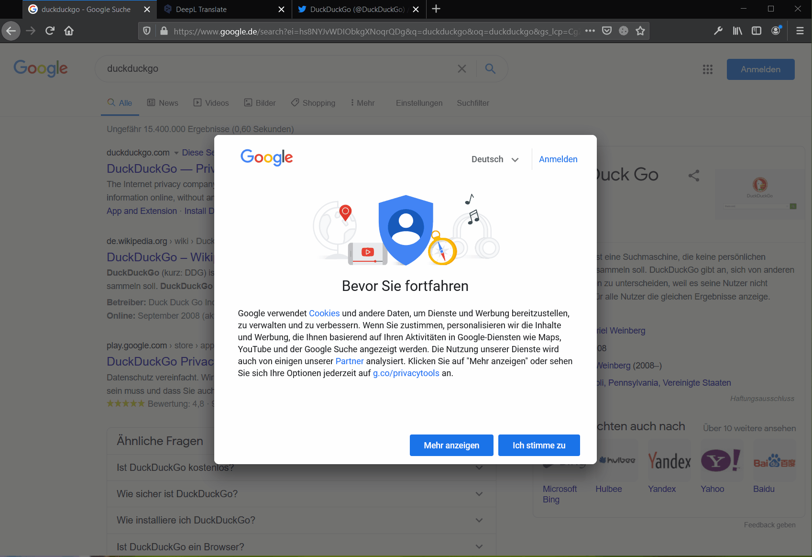

# [Cookie Banner Blocker](https://addons.mozilla.org/de/firefox/addon/cookie-banner-blocker/)

A cookie banner blocker that removes most cookie and newsletter pop-ups without a block list.   
It also detects so-called "consent cookie banner pages" that redirect to a separate consent page before opening the actual page. 

**I started the project out of frustation, because the cookie banners annoy me a lot. Since I use the addon in combination with uBlock Origin, I barely see cookie banners anymore, so the project is finished for me. You are welcome to develop the project further, by forking it.**

[Firefox Addons](https://addons.mozilla.org/de/firefox/addon/cookie-banner-blocker/)

## Goal of the project
There is already the possibility to block cookie banners via blocklists (among others also with the [uBlock Origin](https://github.com/gorhill/uBlock/)). However, this project aims to detect and hide "new" banners or redirect banners **without** a blocklist (without giving consent).

Unfortunately, the detection is not perfect, so there is the possibility to deactivate the cookie banner blocker **with just one click for a single page**:  

## How does the recognition work?
I could identify three different categories of banners.

### Simple cookie banners
These are usually located at the bottom of the page and are very annoying due to their intrusive colour. They can be recognised by the fact that they are fixed (position: fixed) and often have a high Z-index. Since this also applies to most navigations, additional searches are made for keywords (cookie :)).

### Overlay-Banner
These particularly prominent banners blur the background and make the page unusable until accepted. These banners reveal themselves by the fact that they are fixed and have the same size as the actual page. If such an overlay is found, all elements with a higher Z-index are removed. In addition, a CSS rule is inserted that overrides the anti-scrolling rules of the page.

### Redirect-Banner
This category of banners redirect the user to a separate "consent cookie banner pages". They are detected by keywords in the url and the fact that the previous url is usually contained in a GET parameter. The redirection is prevented by changing the user agent to a search engine user agent. After that, there is no need to give consent. After all, the pages still want to be crawled by Google and co.

## Setup
`npm i -g web-ext`

## Credits
I was inspired by this <a href="https://github.com/jannisch/cookie-popup-blocker">Project</a>  
The icons are from <a href="https://fontawesome.com/license">Font Awesome</a>
